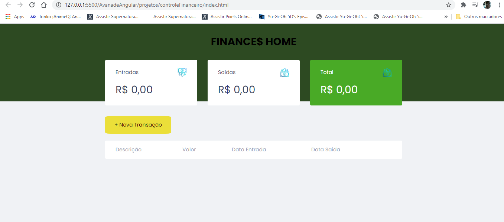

<h1>CONTROLE FINANCEIRO PESSOAL</h1>

<h3>FINANCE$ HOME</h3>

> Status do Projeto: em andamento :runner:

# Descrição do Projeto :star:

Este é um projeto de controle de finança pessoal possui os recursos bsicos para um gerenciamento financeiro de forma simples e eficiente, tais como: controle de contas a pagar e contas a receber. Com controle de data das contas a pagar e a data em que ela foi paga.

## Tecnologias Aplicadas

- :computer: Html5;
- :computer: CSS;
- :computer: Javascript;

## Pré-Requisitos

- [VSCode](https://code.visualstudio.com/docs)

## Contribuintes

  [ <em>Maratona Discover</em>](https://maratonadiscover.rocketseat.com.br)

## Contatos e redes sociais

- :email: eduardo@secautomation.com.br

- 🔗 https://linkedin.com/in/eduardo-alves-francisco

- 🕸️ https://github.com/edukurosaki
